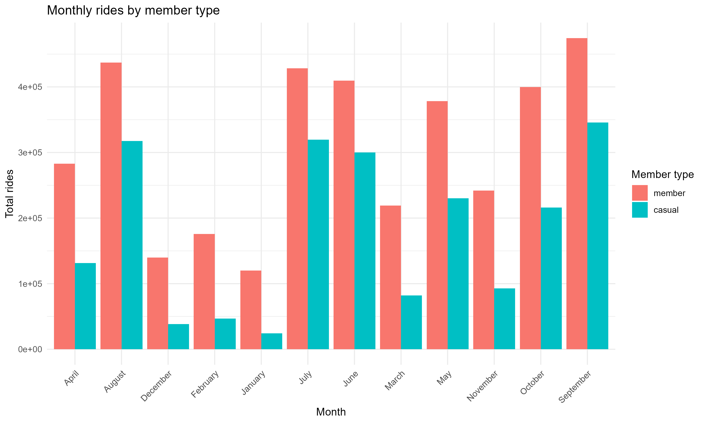

# Cyclistic Bike-Share Analysis (2024)

## Objective
Analyze 2024 Cyclistic bike-share data to understand differences in behavior between annual members and casual riders, and identify opportunities to convert casual riders into members.

## Tools
- **R**: tidyverse, dplyr, ggplot2, ggridges, lubridate, forcats, vroom, janitor, here  
- **Python**: address classification script using Gemini API (`python-dotenv`, `requests`)  
- **Visualization**: ggplot2, bar charts, ridgeline plots  

## 📂 Project Structure

This outlines the main directories and files used in the Cyclistic analysis pipeline.

```tree
Cyclistic-Analysis/
├── data/
│   ├── raw/                  # Raw monthly CSV files (Input Data)
│   ├── cleaned/              # Cleaned and combined data
│   │   └── cyclistic_2024_cleaned.csv
│   └── output/               # Analysis output CSVs (Input for Visualization.R)
│       ├── bike_behavior_by_member.csv
│       ├── daily_by_member.csv
│       ├── duration_summary_by_member.csv
│       ├── duration_time_by_member.csv
│       ├── hourly_by_member.csv
│       ├── member_stats.csv
│       ├── monthly_by_member.csv
│       ├── period_by_member.csv
│       ├── top_start_with_category.csv  # Classified station data
│       ├── top_end_with_category.csv    # Classified station data
│       ├── weekday_month_index.csv
│       └── ... (other intermediate CSVs)
├── plots/                    # Generated PNG/JPEG visualizations
│   ├── top_start_stations_by_member_category.png
│   ├── top_end_stations_by_member_category.png
│   ├── monthly_trends_by_member.png
│   ├── daily_trends_by_member.png
│   ├── bike_type_behavior_by_member.png
│   ├── period_share_by_member.png
│   └── ... (other plots)
├── scripts/                  # Core R scripts
│   ├── analysis.R            # Main script running the full pipeline (data processing + classification + output generation)
│   ├── visualization.R       # Generates all plots from CSVs in data/output/
│   └── data_cyclistic.R      # Cleans, combines, and prepares raw CSVs
├── scripts/python/           # Python scripts for external tasks
│   └── address_classification.py # Classifies stations using the Google Gemini API
├── README.md                 # This file
└── .gitignore                # Specifies files and folders to ignore
```

## Process
1. **Combine and clean raw data**  
   - Load all 12 months of raw CSVs from `data/raw/`  
   - Clean columns, standardize `member_casual` and `rideable_type`  
   - Remove duplicates, invalid rides, missing dates  
   - Add time-based features (hour, day of week, month) and `ride_duration`  

2. **Analysis** (`scripts/analysis.R`)  
   - Compute ride duration distributions, by member type  
   - Aggregate rides by hour, weekday, month, bike type, and ride duration buckets  
   - Identify top 20 start and end stations by member type  
   - Merge station classification from Gemini API (`residential`, `commercial`, `mixed-use`)  

3. **Visualization** (`scripts/visualization.R`)  
   - Bar charts for top stations (excluding "Not Specified")  
   - Member vs casual trends: hourly, daily, monthly  
   - Bike type usage and average duration  
   - Peak/off-peak ride share  
   - Weekday × month distribution heatmap  

## Key Insights
- Members ride more frequently during **weekdays**, casuals ride longer on **weekends**  
- Casual riders prefer **electric bikes**, members prefer **classic bikes**  
- Certain top stations are in **residential areas**, indicating commuting vs recreational patterns  

## Deliverables
- [Cleaned Data (Drive Link)](https://bit.ly/cyclistic_cleaned_2024) 
- [Dashboard (Tableau)](https://public.tableau.com/app/profile/onyedikachi.ikuru/viz/CyclisticBikeSharingViz_17637099897730/StartStationInsights))
- [Output Datasets](data/output/) 
- [Analysis Scripts](scripts/analysis.R)  
- [Visualization Scripts](scripts/visualization.R)  
- [Station Classification Python Script](scripts/address_classification.py)  
- Plots in [plots](plots/) folder:

   Example plots:  
     
     

## Generating the Cleaned Dataset
The cleaned dataset is too large to include in the repo. To generate it locally:

1. Download all raw monthly CSV files into `data/raw/`  
2. Run `scripts/data_cyclistic.R` in R  
   - Outputs: `data/cleaned/cyclistic_2024_cleaned.csv`  
3. Run `scripts/analysis.R` to compute metrics and output CSVs  
4. Run `scripts/python/address_classification.py` to classify top 20 stations  
   - Requires a valid Gemini API key in `.env`  
   - Install dependencies:
      ```bash
      pip install python-dotenv requests
      ```
5. Run scripts/visualization.R to generate all plots in the plots/ folder

---
*Google Data Analytics Capstone Project*
